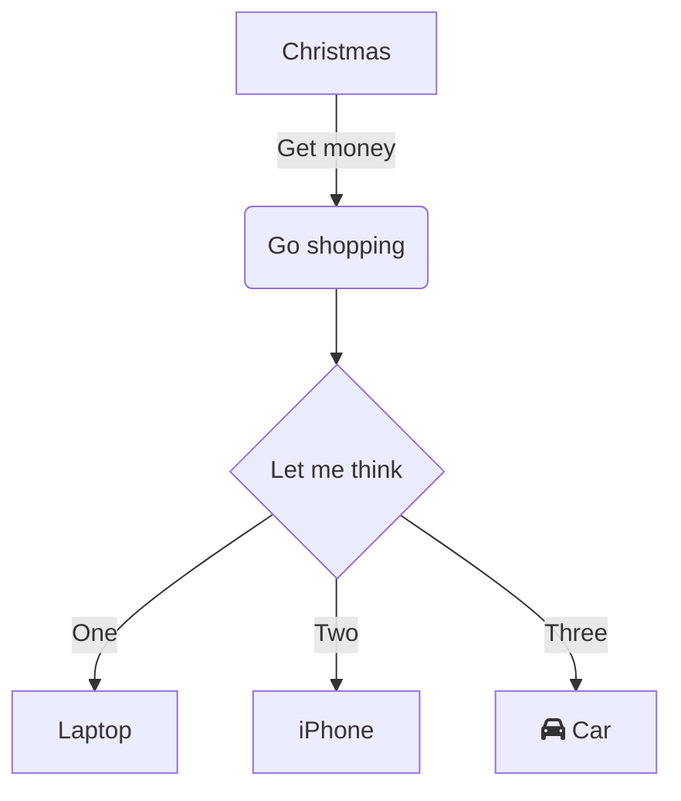

import TOCInline from '@theme/TOCInline';

<TOCInline toc={toc} minHeadingLevel={2} maxHeadingLevel={6} />

---
## Heading 2

Yay

### Heading 3

## Heading 2 again?

It is
a text

#### Heading 4

Also this

##### Heading 5

This one

###### Heading 6

And this beauty here too:

